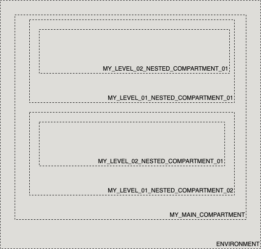

# OCI Cloud Bricks: Compartment

[](https://img.shields.io/badge/license-UPL-green) [](https://sonarcloud.io/dashboard?id=oracle-devrel_terraform-oci-cloudbricks-compartment)

## Introduction
The following cloud brick enables you to create compartments inside a tenancy. You can hook a compartment right from parent/root or you can nest them accoringly to your needs

## Reference Architecture
The folllowing is the reference architecture associated to this brick



### Prerequisites
- OCID of Root Compartment

---
## Sample tfvar file

If the compartment is child of root:

```shell
########## ROOT PARENT ##########
########## SAMPLE TFVAR FILE ##########
########## PROVIDER SPECIFIC VARIABLES ##########
region           = "foo-region-1"
tenancy_ocid     = "ocid1.tenancy.oc1..abcdefg"
user_ocid        = "ocid1.user.oc1..aaaaaaabcdefg"
fingerprint      = "fo:oo:ba:ar:ba:ar"
private_key_path = "/absolute/path/to/api/key/your_api_key.pem"
########## PROVIDER SPECIFIC VARIABLES ##########

########## ARTIFACT SPECIFIC VARIABLES ##########
is_root_parent          = true
root_compartment_ocid   = "ocid1.root.compartment"
compartment_name        = "COMPARTMENT_NAME"
compartment_description = "COMPARTMENT_DESCRIPTION"
enable_delete           = true
########## ARTIFACT SPECIFIC VARIABLES ##########
########## SAMPLE TFVAR FILE ##########
########## ROOT PARENT ##########
```

If the compartment is not child of root

```shell
########## NOT ROOT PARENT ##########
########## SAMPLE TFVAR FILE ##########
########## PROVIDER SPECIFIC VARIABLES ##########
region           = "foo-region-1"
tenancy_ocid     = "ocid1.tenancy.oc1..abcdefg"
user_ocid        = "ocid1.user.oc1..aaaaaaabcdefg"
fingerprint      = "fo:oo:ba:ar:ba:ar"
private_key_path = "/absolute/path/to/api/key/your_api_key.pem"
########## PROVIDER SPECIFIC VARIABLES ##########

########## ARTIFACT SPECIFIC VARIABLES ##########
parent_compartment_name = "DISPLAY_NAME_OF_PARENT_COMPARTMENT"
compartment_name = "COMPARTMENT_NAME"
compartment_description = "COMPARTMENT_DESCRIPTION"
enable_delete = true
########## ARTIFACT SPECIFIC VARIABLES ##########
########## SAMPLE TFVAR FILE ##########
########## NOT ROOT PARENT ##########
```

### Variable specific considerations
- When creating a top level compartment depending on root, is mandatory that variable `is_root_compartment`is set to true and ocid of root compartment is passed on in variable `root_compartment_ocid`
- In both cases, the variable `enable_delete` should be set to `true` if eventually compartments are required to be deleted programatically using terraform. This variable by default is `false`
- You can nest up to six level of depness in compartments. Avoid using deeper nesting as IAM policies will fail to work
- You can create as many compartments as needed, always respecting the nesting limitations

---

## Sample provider
The following is the base provider definition to be used with this module

```shell
terraform {
  required_version = ">= 0.13.5"
}
provider "oci" {
  region       = var.region
  tenancy_ocid = var.tenancy_ocid
  user_ocid        = var.user_ocid
  fingerprint      = var.fingerprint
  private_key_path = var.private_key_path
  disable_auto_retries = "true"
}

provider "oci" {
  alias        = "home"
  region       = data.oci_identity_region_subscriptions.home_region_subscriptions.region_subscriptions[0].region_name
  tenancy_ocid = var.tenancy_ocid  
  user_ocid        = var.user_ocid
  fingerprint      = var.fingerprint
  private_key_path = var.private_key_path
  disable_auto_retries = "true"
}
```
---

## Variable documentation
## Requirements

| Name | Version |
|------|---------|
| <a name="requirement_terraform"></a> [terraform](#requirement\_terraform) | >= 0.13.5 |

## Providers

| Name | Version |
|------|---------|
| <a name="provider_oci"></a> [oci](#provider\_oci) | 4.36.0 |
| <a name="provider_oci.home"></a> [oci.home](#provider\_oci.home) | 4.36.0 |
| <a name="provider_random"></a> [random](#provider\_random) | 3.1.0 |

## Modules

No modules.

## Resources

| Name | Type |
|------|------|
| [oci_identity_compartment.Compartment](https://registry.terraform.io/providers/hashicorp/oci/latest/docs/resources/identity_compartment) | resource |
| [oci_identity_tag.release](https://registry.terraform.io/providers/hashicorp/oci/latest/docs/resources/identity_tag) | resource |
| [oci_identity_tag_namespace.devrel](https://registry.terraform.io/providers/hashicorp/oci/latest/docs/resources/identity_tag_namespace) | resource |
| [random_id.tag](https://registry.terraform.io/providers/hashicorp/random/latest/docs/resources/id) | resource |
| [oci_identity_compartments.PARENTCOMPARTMENT](https://registry.terraform.io/providers/hashicorp/oci/latest/docs/data-sources/identity_compartments) | data source |
| [oci_identity_region_subscriptions.home_region_subscriptions](https://registry.terraform.io/providers/hashicorp/oci/latest/docs/data-sources/identity_region_subscriptions) | data sou
[opc@dalquintdevhubscl terraform-oci-cloudbricks-compartment]$ terraform-docs markdown . 
## Requirements

| Name | Version |
|------|---------|
| <a name="requirement_terraform"></a> [terraform](#requirement\_terraform) | >= 0.13.5 |

## Providers

| Name | Version |
|------|---------|
| <a name="provider_oci"></a> [oci](#provider\_oci) | 4.36.0 |
| <a name="provider_oci.home"></a> [oci.home](#provider\_oci.home) | 4.36.0 |
| <a name="provider_random"></a> [random](#provider\_random) | 3.1.0 |

## Modules

No modules.

## Resources

| Name | Type |
|------|------|
| [oci_identity_compartment.Compartment](https://registry.terraform.io/providers/hashicorp/oci/latest/docs/resources/identity_compartment) | resource |
| [oci_identity_tag.release](https://registry.terraform.io/providers/hashicorp/oci/latest/docs/resources/identity_tag) | resource |
| [oci_identity_tag_namespace.devrel](https://registry.terraform.io/providers/hashicorp/oci/latest/docs/resources/identity_tag_namespace) | resource |
| [random_id.tag](https://registry.terraform.io/providers/hashicorp/random/latest/docs/resources/id) | resource |
| [oci_identity_compartments.PARENTCOMPARTMENT](https://registry.terraform.io/providers/hashicorp/oci/latest/docs/data-sources/identity_compartments) | data source |
| [oci_identity_region_subscriptions.home_region_subscriptions](https://registry.terraform.io/providers/hashicorp/oci/latest/docs/data-sources/identity_region_subscriptions) | data source |

## Inputs

| Name | Description | Type | Default | Required |
|------|-------------|------|---------|:--------:|
| <a name="input_compartment_description"></a> [compartment\_description](#input\_compartment\_description) | Compartment Description | `any` | n/a | yes |
| <a name="input_compartment_name"></a> [compartment\_name](#input\_compartment\_name) | Compartment Display Name | `any` | n/a | yes |
| <a name="input_enable_delete"></a> [enable\_delete](#input\_enable\_delete) | Enables if Terraform is allowed to programatically delete this compartment upon invoking destroy command | `bool` | `false` | no |
| <a name="input_fingerprint"></a> [fingerprint](#input\_fingerprint) | API Key Fingerprint for user\_ocid derived from public API Key imported in OCI User config | `any` | n/a | yes |
| <a name="input_is_root_parent"></a> [is\_root\_parent](#input\_is\_root\_parent) | Boolean that describes if either the root compartment is the parent of this compartment or not | `bool` | `false` | no |
| <a name="input_parent_compartment_name"></a> [parent\_compartment\_name](#input\_parent\_compartment\_name) | Display name of Parent Compartment | `string` | `""` | no |
| <a name="input_private_key_path"></a> [private\_key\_path](#input\_private\_key\_path) | Private Key Absolute path location where terraform is executed | `any` | n/a | yes |
| <a name="input_region"></a> [region](#input\_region) | Target region where artifacts are going to be created | `any` | n/a | yes |
| <a name="input_root_compartment_ocid"></a> [root\_compartment\_ocid](#input\_root\_compartment\_ocid) | Root Compartment OCID Descriptor | `any` | `null` | no |
| <a name="input_tenancy_ocid"></a> [tenancy\_ocid](#input\_tenancy\_ocid) | OCID of tenancy | `any` | n/a | yes |
| <a name="input_user_ocid"></a> [user\_ocid](#input\_user\_ocid) | User OCID in tenancy. | `any` | n/a | yes |

## Outputs

| Name | Description |
|------|-------------|
| <a name="output_compartment"></a> [compartment](#output\_compartment) | Compartment Object |

## Contributing
This project is open source.  Please submit your contributions by forking this repository and submitting a pull request!  Oracle appreciates any contributions that are made by the open source community.

## License
Copyright (c) 2021 Oracle and/or its affiliates.

Licensed under the Universal Permissive License (UPL), Version 1.0.

See [LICENSE](LICENSE) for more details.
